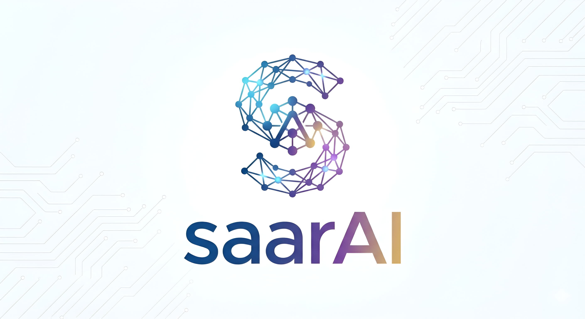
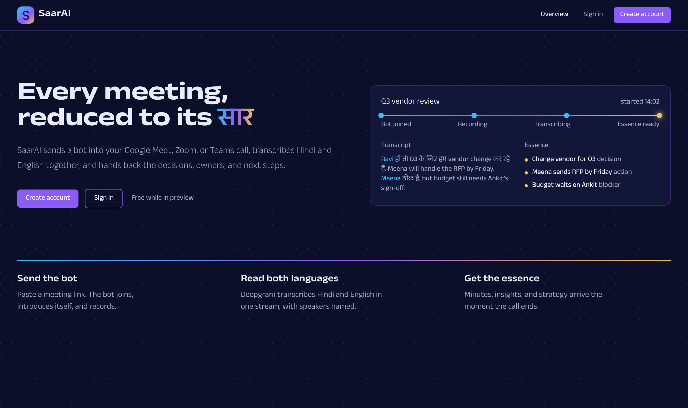
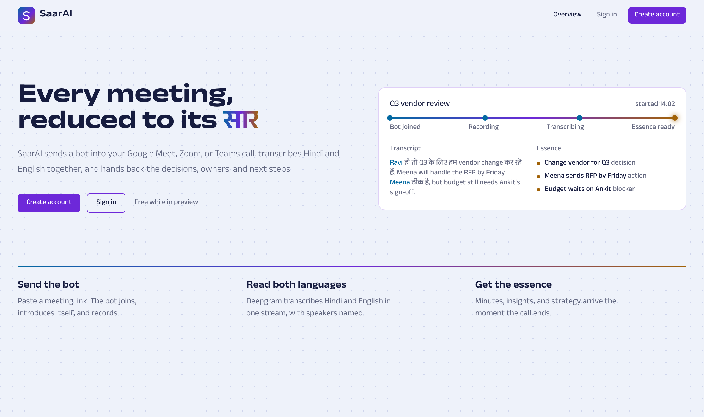
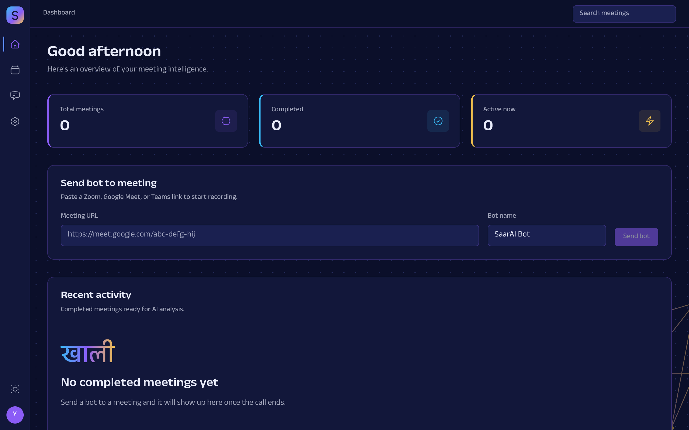
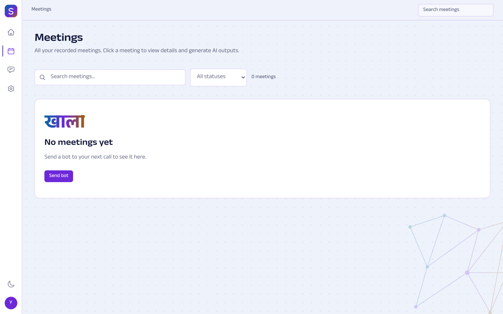
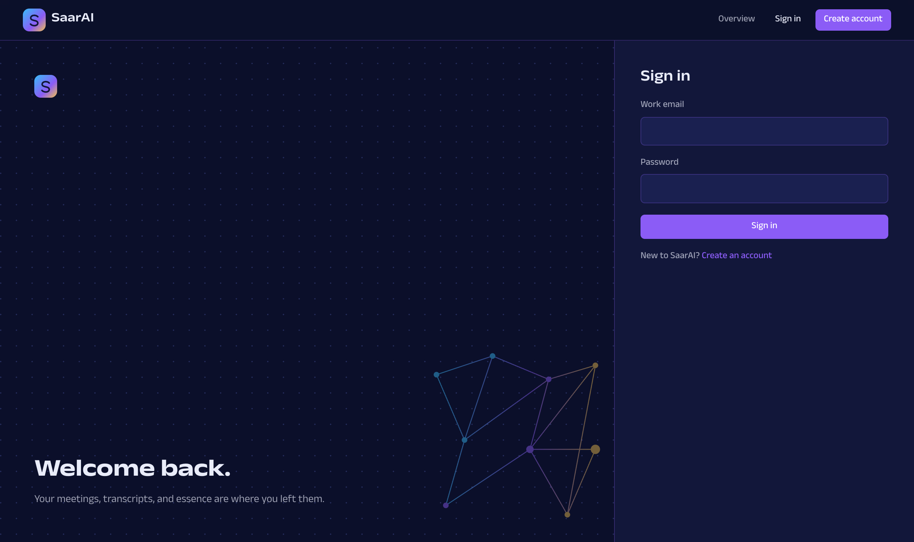
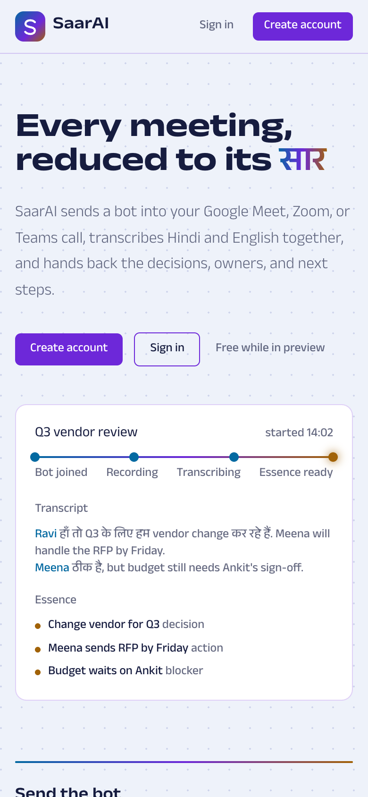
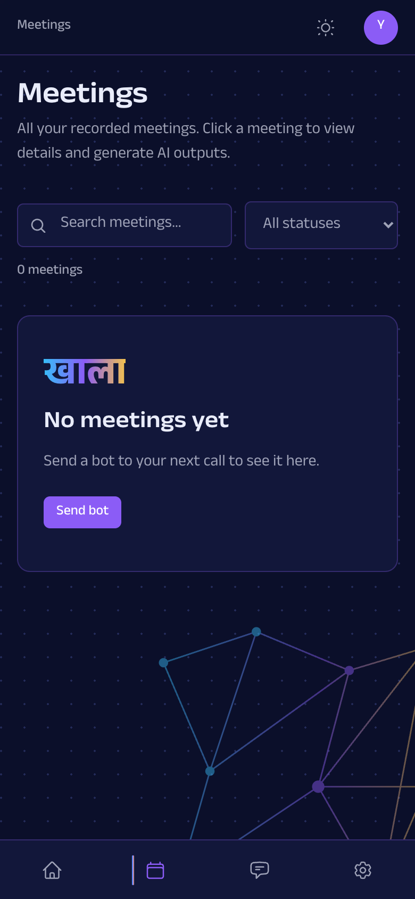

<div align="center">
  
  <br/><br/>
  
  **The Artificial Intelligence of Essence**
  
  *Turn every meeting into actionable insights, automatically*
  
  <br/>
  
  
  
  
  
  [Features](#-key-features) • [How It Works](#-how-it-works) • [The Name](#-why-saarai) • [Credits](#-powered-by)
</div>

---

## ✨ What is SaarAI?

**SaarAI** is an intelligent meeting assistant that transforms raw meeting recordings into structured, actionable intelligence. Built on top of [Attendee's](https://github.com/AskAttendee/attendee) meeting bot infrastructure, it automatically processes transcripts the moment a meeting ends.

> No more manual note-taking. No more forgotten action items. Just clear, AI-generated summaries — delivered automatically.

---

<div align="center">
  
</div>

---

## 🚀 Key Features

| Feature | What You Get |
|---------|--------------|
| 📝 **Minutes of Meeting** | Executive summary, key discussion points, decisions made, action items with owners |
| 💡 **Meeting Insights** | Participation analysis, theme detection, sentiment overview, concerns & blockers |
| 🎯 **Strategy Recommendations** | Priority actions, follow-up suggestions, resource allocation, risk mitigation |
| 🌍 **Multi-Language** | Seamless Hindi + English support via Deepgram |

---

## ⚡ How It Works

```
📅 Meeting Happens     →     🎙️ Deepgram Transcribes     →     🧠 SaarAI Analyzes     →     ✨ Insights Delivered
   (Attendee bot              (Speech-to-text with            (AI processing           (MOM, insights,
    joins & records)           speaker identification)         begins instantly)         strategies ready)
```

---

## 🖥️ The Interface

The web app follows a single visual identity, "Signal mesh", drawn from the logo's cyan, violet, and gold thread.

| What you see | Why |
|---|---|
| **A thread, not a badge** | Every meeting sits on one gradient line: bot joined → recording → transcribing → essence ready. Status is a position on that thread. |
| **Light and dark** | Both themes are first-class. The toggle lives in the rail and in Settings, and the choice is remembered. |
| **Icon rail + top bar** | A 56px rail on desktop, a bottom tab bar on phones. The top bar carries the breadcrumb, meeting search, and a live-bot count. |
| **सार, quietly** | Devanagari appears in the hero and in empty states; every label and control is English. |
| **One typeface** | Anek Devanagari, a variable font that covers Latin and Devanagari in one family. |

<table>
  <tr>
    <td width="50%"></td>
    <td width="50%"></td>
  </tr>
  <tr>
    <td align="center"><sub>Home, light</sub></td>
    <td align="center"><sub>Dashboard, dark</sub></td>
  </tr>
  <tr>
    <td width="50%"></td>
    <td width="50%"></td>
  </tr>
  <tr>
    <td align="center"><sub>Meetings, light</sub></td>
    <td align="center"><sub>Sign in, dark</sub></td>
  </tr>
</table>

<div align="center">
  
  &nbsp;&nbsp;&nbsp;
  
  <br/>
  <sub>On phones the rail becomes a bottom tab bar and the account menu moves to the top bar.</sub>
</div>


---

## 🚀 Getting Started

SaarAI has three parts: the **Attendee** bot platform (Docker), the **SaarAI API** (FastAPI), and the **web app** (React + Vite). SaarAI shares Attendee's Postgres database.

### 1. Start Attendee

```bash
cd attendee
docker compose -f dev.docker-compose.yaml build        # first time only, ~5 min
docker compose -f dev.docker-compose.yaml up -d
docker compose -f dev.docker-compose.yaml exec attendee-app-local python manage.py migrate   # first time only
```

Attendee runs on `http://localhost:8000`, Postgres on `localhost:5432`, Redis on `6379`. See `attendee/README.md` for account setup and the Deepgram credential.

> If you only need the database (for example to work on the API), `docker compose -f dev.docker-compose.yaml up -d postgres redis` is enough.

### 2. Run the SaarAI API

```bash
python3 -m venv .venv && source .venv/bin/activate     # from the repo root
pip install -r saar_ai/requirements.txt
cd saar_ai
uvicorn app.main:app --reload --port 8001
```

`saar_ai/.env` needs:

| Variable | Purpose |
|---|---|
| `DB_HOST`, `POSTGRES_DB`, `POSTGRES_USER`, `POSTGRES_PASSWORD` | Attendee's Postgres (defaults are in `attendee/dev.docker-compose.yaml`) |
| `OPENAI_API_KEY` / `GOOGLE_API_KEY` / `ANTHROPIC_API_KEY` | Whichever LLM provider the generators use |

If Postgres is not running, the API exits with a one-line message telling you how to start it.

### 3. Run the web app

```bash
cd frontend
npm install
npm run dev            # http://localhost:5173
```

Copy `frontend/.env.example` to `frontend/.env` if the API is not on `http://localhost:8001`.

```bash
npm test               # Vitest, 75 tests
npm run typecheck      # tsc -b
npm run build
```

---

## 🗂️ Project Layout

```
SaarAI/
├── attendee/     Meeting bot platform (Django + Celery, Docker)
├── saar_ai/      SaarAI API: FastAPI, SQLAlchemy, LangChain generators
│   └── app/      routers/ (auth, meetings, generate), services/, db/
├── frontend/     Web app: React 18, Vite, Tailwind, Vitest
│   └── src/      pages/, components/{layout,ui}, context/, lib/
└── docs/superpowers/   Design specs and implementation plans
```

---

## 💫 Why "SaarAI"?

The name **SaarAI** (सार + AI) carries deep meaning:

| Component | Meaning |
|-----------|---------|
| **सार (Saar)** | Sanskrit/Hindi for *Essence, Gist, Summary* — the core substance after filtering the noise |
| **AI** | Artificial Intelligence — your intelligent assistant |
| **SaarAI** | *"The AI that extracts the essence"* |

> 🎯 **The Vision**: You provide the long, complex discussion. SaarAI extracts the substance so you can focus on strategy.

*Bonus: "Sarai" in Hebrew means "Princess" — giving our tool a distinguished identity!*

---

## 🔮 Roadmap

### Shipped

- [x] **Meeting bots on Attendee.** Paste a Google Meet, Zoom, or Teams link and a bot joins, records, and leaves. SaarAI shares Attendee's Postgres, so transcripts and participants are read straight from the source.
- [x] **Hindi + English transcription** through Deepgram's multi-language mode, with speakers named.
- [x] **Three AI outputs per meeting**, generated on demand and saved so they load instantly next time:
  - Minutes of meeting: summary, discussion points, decisions, action items with owners
  - Insights: participation, themes, sentiment, concerns and blockers
  - Strategy: priority actions, follow-ups, resource allocation, risk mitigation
- [x] **Switchable LLM provider.** OpenAI or Google Gemini, chosen by environment variable, through one LangChain config.
- [x] **Accounts and API keys.** Email and password sign-up, bcrypt hashing, a per-organization API key on every request.
- [x] **Web app with its own identity.** Light and dark themes, an icon rail with a mobile tab bar, meeting status as a position on a gradient thread, and a bilingual hero.
- [x] **Meeting workspace.** A finished meeting reads as a cited essence document; every decision, action, and risk links back to the transcript line it came from. Live meetings show the transcript as it grows.

### Next

- [ ] **Chat over a meeting.** Ask questions about a transcript and get answers grounded in what was said.
- [ ] **Persisted settings.** Profile, organization, and API key management that actually saves.
- [ ] **Generate automatically when the call ends**, using Attendee webhooks instead of a button.
- [ ] **Search across meetings** by participant, topic, or decision.
- [ ] **Failed and paused bot states** shown honestly on the thread, not folded into "unavailable".

### Later

- [ ] Slack, Notion, and email delivery of the essence
- [ ] Anthropic as a third LLM provider
- [ ] Export to PDF and Markdown
- [ ] More Indian languages beyond Hindi
- [ ] Team roles and shared workspaces

---

## 🙏 Powered By

<div align="center">

| [**Attendee**](https://github.com/attendee-labs/attendee) | [**Deepgram**](https://deepgram.com/) | [**LangChain**](https://langchain.com/) |
|:---:|:---:|:---:|
| Open-source meeting bot platform | Multi-language speech-to-text | Flexible LLM framework |
| *The foundation that makes this possible* | *Powers our transcription* | *Switch AI models easily* |

</div>

---

<div align="center">
  
  Built with ❤️ for smarter meetings
  
  **[Priyanshu](https://github.com/Priyanshu-Iron)**
  
</div>
